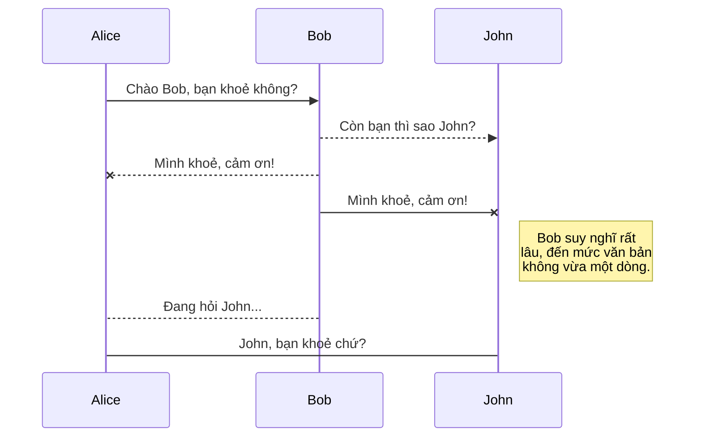
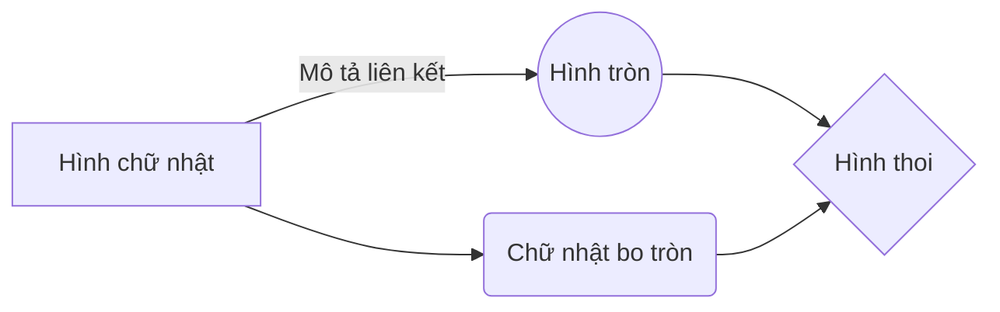

# Chào mừng bạn đến với Weha Markdown!

Xin chào! Tôi là file Markdown đầu tiên của bạn trong **Weha Markdown**. Nếu bạn muốn tìm hiểu về Weha Markdown, hãy đọc tôi. Nếu bạn muốn thử nghiệm với Markdown, hãy chỉnh sửa tôi. Khi đã xong, bạn có thể tạo file mới bằng cách mở **trình quản lý file** ở góc trái thanh điều hướng.

# Quản lý file

Weha Markdown lưu các file của bạn ngay trong trình duyệt, nghĩa là mọi file đều được tự động lưu cục bộ và có thể truy cập **ngoại tuyến!**

## Tạo file và thư mục

Bạn có thể mở trình quản lý file bằng nút ở góc trái thanh điều hướng. Nhấn **File mới** để tạo file và **Thư mục mới** để tạo thư mục.

## Chuyển sang file khác

Tất cả file và thư mục được hiển thị dạng cây trong trình quản lý. Bạn chỉ cần nhấn vào tên file để chuyển qua file đó.

## Đổi tên file

Bạn có thể đổi tên file hiện tại bằng cách nhấn vào tên file trên thanh điều hướng, hoặc nhấn nút **Đổi tên** trong trình quản lý file.

## Xoá file

Nhấn nút **Xoá** trong trình quản lý file để xoá file hiện tại. File sẽ được chuyển vào thư mục **Thùng rác** và tự động bị xoá vĩnh viễn sau 7 ngày không hoạt động.

## Xuất file

Chọn **Xuất ra đĩa** trong menu để xuất file hiện tại. Bạn có thể xuất dưới dạng Markdown thuần, HTML (qua template Handlebars) hoặc PDF.

# Đồng bộ hoá

Đồng bộ hoá là một trong những tính năng nổi bật của Weha Markdown. Tính năng này cho phép bạn đồng bộ file trong không gian làm việc với các file lưu trên **Google Drive**, **Dropbox** và **GitHub**. Nhờ đó bạn có thể tiếp tục viết trên thiết bị khác, cộng tác với người dùng khác, hoặc tích hợp dễ dàng vào quy trình làm việc… Quá trình đồng bộ chạy ngầm mỗi phút — tải xuống, hợp nhất và tải lên những thay đổi.

Có hai kiểu đồng bộ và chúng có thể bổ sung cho nhau:

- Đồng bộ không gian làm việc: tự động đồng bộ tất cả file, thư mục và thiết lập. Nhờ đó bạn có thể lấy lại toàn bộ workspace trên thiết bị khác.
	> Để bắt đầu, hãy đăng nhập bằng Google từ menu.

- Đồng bộ file: giữ một file trong workspace đồng bộ với một hoặc nhiều file trên **Google Drive**, **Dropbox** hoặc **GitHub**.
	> Trước khi đồng bộ, bạn cần liên kết tài khoản trong menu con **Đồng bộ**.

## Mở file

Bạn có thể mở file từ **Google Drive**, **Dropbox** hoặc **GitHub** bằng cách vào menu con **Đồng bộ** và nhấn **Mở từ**. Sau khi mở, mọi chỉnh sửa sẽ được đồng bộ tự động.

## Lưu file

Bạn có thể lưu bất kỳ file nào trong workspace lên **Google Drive**, **Dropbox** hoặc **GitHub** qua menu con **Đồng bộ**, nhấn **Lưu vào**. Dù file đã được đồng bộ, bạn vẫn có thể lưu nó tới nơi khác. Weha Markdown cho phép đồng bộ một file với nhiều vị trí và nhiều tài khoản.

## Đồng bộ một file

Khi file đã được liên kết với một vị trí đồng bộ, Weha Markdown sẽ định kỳ đồng bộ bằng cách tải xuống/tải lên mọi thay đổi. Hệ thống sẽ thực hiện hợp nhất và xử lý xung đột nếu cần.

Nếu bạn vừa chỉnh sửa file và muốn đồng bộ ngay, hãy nhấn nút **Đồng bộ ngay** trên thanh điều hướng.

> **Lưu ý:** Nút **Đồng bộ ngay** sẽ bị vô hiệu hoá nếu không có file nào cần đồng bộ.

## Quản lý đồng bộ file

Vì một file có thể đồng bộ với nhiều vị trí, bạn có thể xem và quản lý các vị trí đồng bộ bằng cách chọn **Đồng bộ file** trong menu con **Đồng bộ**. Tại đây bạn có thể liệt kê và gỡ các vị trí đồng bộ đã liên kết với file.

# Xuất bản

Tính năng xuất bản của Weha Markdown giúp bạn chia sẻ file lên mạng một cách dễ dàng. Khi đã hài lòng với file, bạn có thể xuất bản lên nhiều nền tảng như **Blogger**, **Dropbox**, **Gist**, **GitHub**, **Google Drive**, **WordPress** và **Zendesk**. Với [template Handlebars](http://handlebarsjs.com/), bạn có toàn quyền kiểm soát nội dung được xuất.

> Trước khi xuất bản, bạn cần liên kết tài khoản trong menu con **Xuất bản**.

## Xuất bản một file

Mở menu con **Xuất bản** và nhấn **Xuất bản tới**. Với một số vị trí, bạn có thể chọn định dạng:

- Markdown: xuất bản Markdown gốc lên trang hỗ trợ Markdown (ví dụ **GitHub**),
- HTML: xuất bản file đã được chuyển thành HTML qua template Handlebars (ví dụ blog).

## Cập nhật bản đã xuất

Sau khi xuất bản, Weha Markdown sẽ ghi nhớ liên kết để bạn tái xuất bản dễ dàng. Khi đã chỉnh sửa file và muốn cập nhật, hãy nhấn nút **Xuất bản ngay** trên thanh điều hướng.

> **Lưu ý:** Nút **Xuất bản ngay** sẽ bị vô hiệu hoá nếu file chưa từng được xuất bản.

## Quản lý xuất bản file

Vì một file có thể được xuất bản tới nhiều nơi, bạn có thể xem và quản lý các vị trí bằng cách chọn **Xuất bản file** trong menu con **Xuất bản**. Bạn có thể liệt kê và gỡ các vị trí đã liên kết với file.

# Tiện ích mở rộng Markdown

Weha Markdown mở rộng cú pháp Markdown chuẩn bằng các **tiện ích mở rộng Markdown**, mang lại nhiều tính năng hữu ích.

> **Mẹo:** Bạn có thể tắt bất kỳ **tiện ích mở rộng Markdown** nào trong hộp thoại **Thuộc tính file**.

## SmartyPants

SmartyPants chuyển các ký tự dấu câu ASCII thành ký tự typographic "thông minh". Ví dụ:

|                |ASCII                          |HTML                         |
|----------------|-------------------------------|-----------------------------|
|Dấu nháy đơn    |`'Isn't this fun?'`            |'Isn't this fun?'            |
|Dấu ngoặc kép   |`"Isn't this fun?"`            |"Isn't this fun?"            |
|Gạch ngang      |`-- is en-dash, --- is em-dash`|-- is en-dash, --- is em-dash|

## KaTeX

Bạn có thể hiển thị biểu thức toán LaTeX bằng [KaTeX](https://khan.github.io/KaTeX/):

Hàm *Gamma* thoả mãn $\Gamma(n) = (n-1)!\quad\forall n\in\mathbb N$ qua tích phân Euler

$$
\Gamma(z) = \int_0^\infty t^{z-1}e^{-t}dt\,.
$$

> Bạn có thể tìm hiểu thêm về biểu thức toán **LaTeX** [tại đây](http://meta.math.stackexchange.com/questions/5020/mathjax-basic-tutorial-and-quick-reference).

## Sơ đồ UML

Bạn có thể vẽ sơ đồ UML bằng [Mermaid](https://mermaidjs.github.io/). Ví dụ, đoạn sau sẽ tạo một sơ đồ tuần tự:

Và đoạn này sẽ tạo một flow chart:

